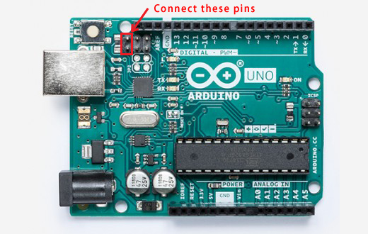

# NabuKeys
Nabu Keyboard Tester/Translator/Emulator

This Arduino sketch can function in four different modes:

* Tester Mode: Capture keystrokes from a NABU keyboard and print them over serial.
* Forward Translator Mode: Use a NABU keyboard as a USB keyboard on a modern device.
* Emulator Mode: Read instructions over serial and send keystrokes to a NABU computer.
* Reverse Translator Mode: Use a modern USB keyboard as a keyboard on a NABU computer.

To compile the sketch you must add the USB Host Shield library to the Arduino IDE, found [here](https://github.com/felis/USB_Host_Shield_2.0). Or, if you do not plan to use Reverse Translator Mode, you can comment out the line `#define USBK_USE_HOST_SHIELD` in `usbkeysconfig.h`.

There are also gerber files for a shield. This is very useful as a few components are required to connect a NABU keyboard to an Arduino (or an Arduino to the keyboard port on a NABU computer).

## Components
For this sketch to work properly, you will need:

* 1x Arduino (duh)
* 1x DIN-6 connector
* 1x SN75176AP bus transceiver
* 1x 180Ω resistor
* 2x 1nF ceramic capacitor
* 1x IRLU110PBF or similar MOSFET
* 1x 10KΩ resistor

## Connections

### NABU Keyboard Connections
* Pin 1, NC: not connected.
* Pin 2, GND: connect to MOSFET drain.
* Pin 3, 9V: connect to Arduino VIN. (DO NOT CONNECT TO +5V. The keyboard requires and the NABU provides 9V.)
* Pin 4, A: connect to SN75176AP pin 6 (A).
* Pin 5, B: connect to SN75176AP pin 7 (B).
* Pin 6, NC: not connected.

### Arduino Connections
* Digital pins 0-1: reserved for serial port.
* Digital pin 2: connect to MOSFET gate.
* Digital pin 3: connect to SN75176AP pin 1 (R).
* Digital pin 4: connect to SN75176AP pins 2 and 3 (#RE and DE).
* Digital pin 5: connect to SN75176AP pin 4 (D).
* Digital pin 6: not connected.
* Digital pins 7-13: reserved for USB Host Shield.
* Analog pins A0-A5: used to select settings.

### Other Connections
* MOSFET source to Arduino GND.
* 10KΩ resistor across MOSFET gate (equivalently digital pin 2) and Arduino GND.
* 180Ω resistor across SN75176AP pins 6 and 7 (equivalently DIN-6 pins 4 and 5).
* 1nF capacitor across SN75176AP pin 6 (equivalently DIN-6 pin 4) and Arduino GND.
* 1nF capacitor across SN75176AP pin 7 (equivalently DIN-6 pin 5) and Arduino GND.
* SN75176AP pin 5 to Arduino GND.
* SN75176AP pin 8 to Arduino +5V. (DO NOT CONNECT TO VIN.)

### "DIP Switch" Settings
Analog pins are used to select the mode of operation and settings for that mode. These are present on the shield as switches or jumpers labeled A-F. To leave the "DIP switch" in the OPEN position, leave the pin disconnected or set the switch to the UP position. To leave the "DIP switch" in the CLOSED position, connect the pin to GND or set the switch to the DOWN position.

* Analog pin 0 / switch A:
  * OPEN: `NK>` - Nabu Keyboard In. Tester / Forward Translator Mode. Connect NABU keyboard to Arduino and Arduino to modern device.
  * CLOSED: `>NH` - To Nabu Host. Emulator / Reverse Translator Mode. Connect modern device to Arduino and Arduino to NABU computer.
* Analog pin 1 / switch B:
  * OPEN: `SER` - Serial. Tester / Emulator Mode. Arduino communicates with a modern device over serial.
  * CLOSED: `USB`. Translator Mode. Arduino acts as a USB keyboard device or host, depending on switch A.
* Analog pin 2 / switch C:
  * In Tester / Emulator Mode:
    * OPEN: Key events are output / input as debug statements or ASCII characters.
    * CLOSED: Key events are output / input as raw hex dump or raw binary.
  * In Forward Translator Mode:
    * OPEN: Use PAUSE and TV/NABU for Alt and Meta. Use SYM to select alternate interpretations for other keys.
    * CLOSED: Use PAUSE and SYM for Alt and Meta. Use TV/NABU to select alternate interpretations for other keys.
* Analog pin 3 / switch D:
  * In Tester / Emulator Mode:
    * OPEN: Key events are output / input as debug statements or raw hex dump.
    * CLOSED: Key events are output / input as ASCII characters or raw binary.
  * In Forward Translator Mode:
    * OPEN: If switch C is OPEN, PAUSE = Alt and TV/NABU = Meta. If switch C is CLOSED, PAUSE = Meta and SYM = Alt.
    * CLOSED: If switch C is OPEN, PAUSE = Meta and TV/NABU = Alt. If switch C is CLOSED, PAUSE = Alt and SYM = Meta.
* Analog pin 4 / switch E:
  * In Tester Mode, with switch A OPEN and switch B OPEN (debug mode):
    * OPEN: Do not display time in milliseconds since last event.
    * CLOSED: Display time in milliseconds since last event.
  * In Tester Mode, with switch A OPEN and switch B CLOSED (ASCII mode):
    * OPEN: GO = 0x0D (CR) and DELETE = 0x7F (DEL).
    * CLOSED: GO = 0x0A (LF) and DELETE = 0x08 (BS).
  * In Forward Translator Mode:
    * OPEN: If switch F is OPEN, YES = PgUp and NO = PgDn. If switch F is CLOSED, YES = Home and NO = End.
    * CLOSED: If switch F is OPEN, YES = `Y` and NO = `N`. If switch F is CLOSED, YES = `|` and NO = `\`.
* Analog pin 5 / switch F:
  * In Tester Mode, with switch A OPEN and switch B OPEN (debug mode):
    * OPEN: Display watchdog events.
    * CLOSED: Do not display watchdog events.
  * In Tester Mode, with switch A OPEN and switch B CLOSED (ASCII mode):
    * OPEN: YES = 0x06 (ACK) and NO = 0x15 (NAK).
    * CLOSED: YES = 0x19 (^Y) and NO = 0x0E (^N).
  * In Forward Translator Mode:
    * OPEN: ◁||| = Home and |||▷ = End. If switch E is OPEN, YES = PgUp and NO = PgDn. If switch E is CLOSED, YES = `Y` and NO = `N`.
    * CLOSED: ◁||| = PgUp and |||▷ = PgDn. If switch E is OPEN, YES = Home and NO = End. If switch E is CLOSED, YES = `|` and NO = `\`.

## Tester Mode
Connect a NABU keyboard to the Arduino. Connect the Arduino to a modern device over USB. Connect to the Arduino from the modern device over USB serial at 9600 baud (using the Arduino Serial Monitor, for example). Key events coming from the NABU keyboard will be printed over serial.

With analog pins 2, 3 / switches C, D both OPEN, key events will be printed as messages, as in the following example output.

    READY
    STATUS 95 Reset
    STATUS 94 Watchdog
    ASCII 48 H
    ASCII 69 i
    ASCII 0D Go
    STATUS 94 Watchdog
    PRESSED E8 Sym
    RELEASED F8 Sym
    STATUS 94 Watchdog
    STATUS 94 Watchdog

If analog pin 4 / switch E is CLOSED, each line will be prefixed with the time in milliseconds since the previous event.

    READY
    290 STATUS 95 Reset
    3650 STATUS 94 Watchdog
    1296 ASCII 48 H
    707 ASCII 69 i
    886 ASCII 0D Go
    761 STATUS 94 Watchdog
    2199 PRESSED E8 Sym
    1108 RELEASED F8 Sym
    343 STATUS 94 Watchdog
    3650 STATUS 94 Watchdog

If analog pin 5 / switch F is CLOSED, the `STATUS 94 Watchdog` lines will not be printed.

    READY
    STATUS 95 Reset
    ASCII 48 H
    ASCII 69 i
    ASCII 0D Go
    PRESSED E8 Sym
    RELEASED F8 Sym

With analog pin 2 / switch C OPEN and analog pin 3 / switch D CLOSED, key presses will be output as ASCII. Special function keys will be translated to control characters. The SYM key sets the high bit. The above sequence of key events will produce the byte sequence `48 69 0D`.

If analog pin 4 / switch E is CLOSED, the GO and DELETE keys will be translated to newline (`0A`) and backspace (`08`). Otherwise, they will be left untranslated as CR (`0D`) and DEL (`7F`).

If analog pin 5 / switch F is OPEN, YES and NO will be translated to ACK (`06`) and NAK (`15`). If CLOSED, YES and NO will be translated to ^Y (`19`) and ^N (`0E`).

    YES        will be translated to    06    if switch F is OPEN
    DELETE     will be translated to    08    if switch E is CLOSED
    TAB        will pass through as     09
    GO         will be translated to    0A    if switch E is CLOSED
    GO         will pass through as     0D    if switch E is OPEN
    NO         will be translated to    0E    if switch F is CLOSED
    ◁|||       will be translated to    11
    |||▷       will be translated to    12
    PAUSE      will be translated to    13
    TV/NABU    will be translated to    14
    NO         will be translated to    15    if switch F is OPEN
    YES        will be translated to    19    if switch F is CLOSED
    ESC        will pass through as     1B
    ←          will be translated to    1C
    →          will be translated to    1D
    ↑          will be translated to    1E
    ↓          will be translated to    1F
    DELETE     will pass through as     7F    if switch E is OPEN

With analog pin 2 / switch C CLOSED and analog pin 3 / switch D OPEN, key events will be printed as raw hex dump. The example sequence of key events will produce the ASCII string `959448690D94E8F89494`.

With analog pins 2, 3 / switches C, D both CLOSED, key events will be output as raw binary. The example sequence of key events will produce the byte sequence `95 94 48 69 0D 94 E8 F8 94 94`.

### Switch Settings
* Analog pins 0, 1 / switches A, B must both be OPEN in this mode.
* Analog pins 2, 3 / switches C, D select the format of the output:
  * OPEN, OPEN: Key events are output as a one-line message describing the event.
  * OPEN, CLOSED: Key presses are output as ASCII.
  * CLOSED, OPEN: Key events are output as raw hex dump.
  * CLOSED, CLOSED: Key events are output as raw binary.
* If analog pins 2, 3 / switches C, D are both OPEN:
  * Closing analog pin 4 / switch E will output time in ms since last event.
  * Closing analog pin 5 / switch F will hide watchdog events.
* If analog pin 2 / switch C is OPEN and analog pin 3 / switch D is CLOSED:
  * Analog pin 4 / switch E selects the translation of GO and DELETE.
    * OPEN: GO = CR (`0D`), DELETE = DEL (`7F`)
    * CLOSED: GO = LF (`0A`), DELETE = BS (`08`)
  * Analog pin 5 / switch F selects the translation of YES and NO.
    * OPEN: YES = ACK (`06`), NO = NAK (`15`)
    * CLOSED: YES = ^Y (`19`), NO = ^N (`0E`)

## Forward Translator Mode
To use Forward Translator Mode, you must first reflash the Arduino's USB controller with firmware that will allow the Arduino to function as a USB keyboard. Once you do this, you won't be able to program the Arduino until you reverse the process, so upload the sketch to the Arduino first.

### Reflashing the USB Controller Firmware
* Download the file `Arduino-keyboard-0.3.hex` in the `firmware` directory.
* Download and install ATMEL FLIP from https://www.microchip.com/developmenttools/ProductDetails/FLIP
* Connect the Arduino.
* Short the two male header pins on the Arduino closest to the USB port for a few seconds. (If you're on Windows, you should hear the "device disconnected" sound when connecting the pins and the "device connected" sound when disconnecting the pins.)

* Open ATMEL FLIP.
* Click the button for "Select a Target Device" and select ATmega16U2.
* Click the button for "Select a Communication Medium" and select USB, then click Open.
* Go to Buffer > Options. Make sure "Reset Buffer Before Loading" is set to Yes and "Address Programming Range" is set to Whole Buffer.
* If this is your first time doing this:
  * Click the button for "Read Target Device Memory".
  * Click the button for "Save Buffer As HEX File" and save it as, for example, `arduino.hex`. (You can use this file later to turn your Arduino from a keyboard back into an Arduino.)
* Click the button for "Load HEX File" and select the `Arduino-keyboard-0.3.hex` file.
* Click the Run button.
* Once the programming is done, disconnect the Arduino.

To reverse this process, do the same thing but select your saved `arduino.hex` file instead of the `Arduino-keyboard-0.3.hex` file.

### Using Forward Translator Mode
Connect a NABU keyboard to the Arduino. Connect the Arduino to a modern device over USB. Use the NABU keyboard as a USB keyboard.

TBD

### Switch Settings
* Digital pin 5 / switch A must be OPEN.
* Digital pin 4 / switch B must be CLOSED.
* TBD

## Emulator Mode
Connect a modern device to the Arduino over USB. Connect the Arduino to the NABU keyboard port. Connect to the Arduino from the modern device over USB serial at 9600 baud (using the Arduino Serial Monitor, for example).

TBD

### Switch Settings
* Digital pin 5 / switch A must be CLOSED.
* Digital pin 4 / switch B must be OPEN.
* TBD

## Reverse Translator Mode
To use Reverse Translator Mode, you must add a USB Host Shield to the Arduino. [Sparkfun has one for sale.](https://www.sparkfun.com/products/9947) You must also add the USB Host Shield library to the Arduino IDE, found [here](https://github.com/felis/USB_Host_Shield_2.0).

If using the Sparkfun USB Host Shield, you'll need to add a wire from digital pin 7 to the RESET line. Additionally, if you are using an Arduino Mega, you'll need to route pins 13, 12, 11, and 10 to pins 52, 50, 51, and 53, respectively.

Connect a USB keyboard to the USB Host Shield. Connect the Arduino to the NABU keyboard port. Use the USB keyboard as the NABU's keyboard.

TBD

### Switch Settings
* Digital pins 5, 4 / switches A, B must be CLOSED.
* TBD

## Acknowledgements

Special thanks to: [Jason Thorpe](https://github.com/thorpej) for [nabu-keyboard-usb](https://github.com/thorpej/nabu-keyboard-usb)
